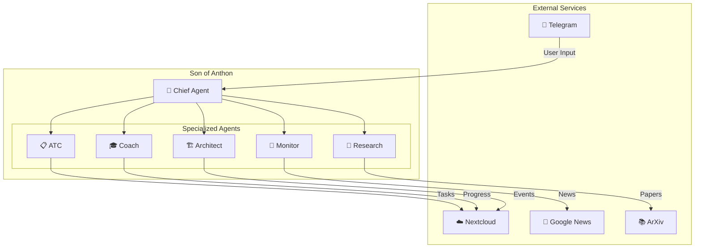

# Son of Anthon


> **Your Morning Briefing**: "You have 3 tasks due today, your 'Deep Learning' course is 60% complete, and Bangladesh tech stocks are up 2%."

> ⚠️ **WARNING: This project is under active development and NOT production-ready.**
> Use for testing/development only. APIs, features, and data formats may change.

---

## 🎯 What Is Son of Anthon?

**A local-first AI operating system that manages your life through intelligent agents.**

Unlike cloud-based assistants that own your data, Son of Anthon:

- ✅ Runs entirely on your machine (or phone via Termux)
- ✅ Syncs with YOUR Nextcloud (not their servers)
- ✅ Uses your own API keys (no subscription fees)
- ✅ Sends morning briefings via Telegram when you want them

Your data stays in your own Nextcloud. No third-party cloud storage. You own everything.

Think of it as having a personal Chief of Staff, Learning Coach, and Research Assistant in one system.

---

## 🏗️ Architecture



---

## 🤖 Meet Your Agents

<details>
<summary><b>👔 Chief</b> — The Orchestrator</summary>

Your main interface. Sends morning briefings at 7 AM and routes commands to specialists.

**Example**: `@chief Good morning` or `@chief brief me`
</details>

<details>
<summary><b>📋 ATC</b> — Task Coordinator</summary>

Manages your task inbox with Nextcloud sync. Create, close, and track tasks.

**Example**: `@atc add_task Fix bug in login flow --due tomorrow`
</details>

<details>
<summary><b>🎓 Coach</b> — Learning Tracker</summary>

Tracks courses, books, habits with Nextcloud Deck Kanban boards.

**Example**: `@coach I'm on page 50 of Deep Learning`
</details>

<details>
<summary><b>🏗️ Architect</b> — Life Admin</summary>

Handles bills, recurring deadlines, and calendar management.

**Example**: `@architect When is my next bill due?`
</details>

<details>
<summary><b>📰 Monitor</b> — News Digest</summary>

Delivers curated news digests (Bangladesh, Tech, AI, Finance).

**Example**: `@monitor news --topic ai --limit 5`
</details>

<details>
<summary><b>🔬 Research</b> — Paper Discovery</summary>

Discovers academic papers from arXiv and Semantic Scholar.

**Example**: `@research large language model alignment`
</details>

---

## ✅ Prerequisites Checklist

Before running `onboard`, ensure you have:

- [ ] NVIDIA API key from [build.nvidia.com](https://build.nvidia.com)
- [ ] Telegram Bot Token from [@BotFather](https://t.me/botfather) (optional)
- [ ] Nextcloud instance with app-password (optional but recommended)

---

## 🚀 Quick Start

### Option 1: Pre-built Binaries (Recommended)

1. Download from [Releases](https://github.com/JonyBepary/son-of-anthon/releases) for your platform
2. Run the onboard wizard:

```bash
# Linux/macOS/Termux
chmod +x son-of-anthon
./son-of-anthon onboard --full

# Windows (PowerShell Admin)
.\son-of-anthon.exe onboard --full
```

### Option 2: Package Managers

```bash
# Debian/Ubuntu
sudo dpkg -i son-of-anthon_*.deb
sudo systemctl enable son-of-anthon

# macOS (extract and install)
tar -xf son-of-anthon_*.tar
./install.sh
```

### Post-Installation

```bash
# Start the onboarding wizard
son-of-anthon onboard --full

# Check status
son-of-anthon onboard --status
```

---

## 📸 See It In Action

<details>
<summary>Click to view screenshots</summary>


</details>

---

## 📖 Configuration

The config is stored at `~/.picoclaw/config.json` (shares config with PicoClaw framework):

```json
{
  "agents": {
    "defaults": {
      "provider": "qwen",
      "model": "qwen/qwen3.5-397b-a17b"
    },
    "list": [
      {
        "id": "chief",
        "name": "Chief",
        "default": true
      }
    ]
  },
  "model_list": [{
    "provider": "qwen",
    "api_key": "YOUR_NVIDIA_API_KEY",
    "api_base": "https://integrate.api.nvidia.com/v1"
  }],
  "channels": {
    "telegram": {
      "enabled": true,
      "token": "YOUR_TELEGRAM_BOT_TOKEN",
      "allow_from": ["YOUR_CHAT_ID"]
    }
  },
  "tools": {
    "nextcloud": {
      "host": "https://your-nextcloud.com",
      "username": "your-email",
      "password": "app-password"
    }
  }
}
```

> ⚠️ **Never commit `config.json`** — it contains API keys. Add `~/.picoclaw/` to your `.gitignore`.

---

## 🎓 Coach Learning Commands

Track courses, books, and videos with pace tracking and Kanban visualization:

```bash
# Add a course
coach add_course --course_name "Deep Learning" --course_type book --total_units 15

# List active courses
coach my_courses

# Show progress
coach progress --course_name "Deep Learning"

# Log completed units
coach log_progress --course_name "Deep Learning" --completed_units "5"

# Weekly stats
coach weekly

# ETA estimate
coach estimate_finish --course_name "Deep Learning"

# Sync to Nextcloud Deck (Kanban board)
coach sync_deck
```

### Nextcloud Deck Integration

Coach syncs your learning progress to a visual Kanban board with 3 automatic stacks:

- **Want To Learn** (Blue) — Courses with 0% progress
- **In Progress** (Orange) — Courses with 1-99% progress
- **Completed** (Green) — Courses at 100%

Each card shows:

- Progress bars (X/Y units, percentage)
- Weekly progress charts (text-based bars)
- Monthly summary and velocity stats
- Auto-generated labels (course type, topics)

Cards automatically move between stacks as you make progress. See [docs/DECK_KANBAN_UPDATE.md](docs/DECK_KANBAN_UPDATE.md) for details.

---

## 📰 News Sources (Monitor)

Default curated feeds:

- **Bangladesh**: Prothom Alo, The Daily Star, bdnews24, Google News
- **World**: Google News (breaking)
- **AI**: OpenAI, GPT, Gemini, Claude, LLM
- **Tech**: Apple, Google, Microsoft, NVIDIA
- **Finance**: Stock, crypto, economy
- **Policy**: Government, election, parliament

---

## 🛠️ Troubleshooting

**"onboard --full hangs on agent setup"**
→ Check your NVIDIA API key has credits available

**"Telegram bot not responding"**
→ Verify `allow_from` contains your correct Chat ID (use @userinfobot to get it)

**"Nextcloud sync fails"**
→ Ensure you're using an App Password, not your main account password

### Logs

```bash
# View live logs
son-of-anthon logs --follow

# View recent errors
son-of-anthon logs --errors
```

---

## 💡 Pro Tips from Users

> "I set up Coach to track my AWS cert study. The Kanban view in Nextcloud Deck keeps me honest about progress."

---

## 🤝 Contributing

We need help with:

- **Web UI**: React/Vue frontend (low priority but wanted)
- **New Agents**: Calendar optimization agent, Finance tracker
- **Testing**: Windows ARM64, macOS Apple Silicon builds

This project is in early development. PRs welcome, but check [open issues](https://github.com/JonyBepary/son-of-anthon/issues) first.

- `main` branch: unstable dev
- For agent prompt improvements, edit files in `pkg/skills/`

---

## 🗺️ Roadmap

- [x] Chief: master orchestrator
- [x] ATC: Nextcloud task sync
- [x] Coach: course tracking with SQLite
- [x] Coach: Nextcloud Deck/Tasks/Calendar sync
- [ ] Monitor: RSS digest with summaries
- [ ] Research: arXiv paper recommendations
- [ ] Web UI (optional, low priority)

---

## 📄 License

AGPL-3.0 — See [LICENSE](LICENSE) for details.
