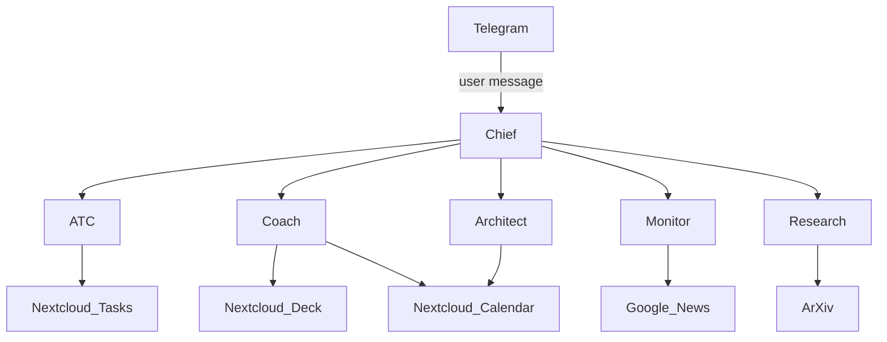

# Son of Anthon ⚠️


> **WARNING: This project is under active development and NOT production-ready.**
> Use for testing/development only. APIs, features, and data formats may change.

---

## What Is Son of Anthon?

Son of Anthon is a personal AI OS that runs quietly in the background on your machine or phone (Termux). It manages your tasks, learning goals, news, and life admin through a team of specialized AI agents — all coordinated by a master "Chief" agent that briefs you each morning.

Your data stays in your own Nextcloud. No third-party cloud storage. You own everything.

---

## Architecture



---

## Agents

| Agent | Role | Integrations |
|-------|------|--------------|
| **Chief** | Master orchestrator, morning briefs, delegates to other agents | All agents |
| **ATC** | Task inbox, create/close tasks, calendar sync | Nextcloud Tasks, CalDAV |
| **Architect** | Life admin, bills, recurring deadlines | Nextcloud Calendar |
| **Coach** | Learning tracker, course progress, habit streaks | Nextcloud Deck, Tasks, Calendar |
| **Monitor** | Curated news digest (Bangladesh, Tech, AI, Finance) | Google News RSS |
| **Research** | Academic paper discovery | arXiv, Semantic Scholar |

---

## Quick Start

### One-Command Setup (All Platforms)

```bash
# Download from Releases: https://github.com/JonyBepary/son-of-anthon/releases

# Termux/Proot
tar -xf son-of-anthon_*_android_arm64.tar
./son-of-anthon onboard --full

# Linux (systemd)
sudo apt install ./son-of-anthon_*.deb

# macOS
tar -xf son-of-anthon_*.tar
./install.sh

# Windows
Extract zip and run install.bat
```

Or use the onboard command for automated setup:
```bash
son-of-anthon onboard --full    # Everything at once
son-of-anthon onboard --status  # Check status
```

---

## Configuration

The config is stored at `~/.picoclaw/config.json` (shares config with PicoClaw framework):

```json
{
  "agents": {
    "defaults": {
      "provider": "qwen",
      "model": "qwen/qwen3.5-397b-a17b"
    },
    "list": [
      {
        "id": "chief",
        "name": "Chief",
        "default": true
      }
    ]
  },
  "model_list": [{
    "provider": "qwen",
    "api_key": "YOUR_NVIDIA_API_KEY",
    "api_base": "https://integrate.api.nvidia.com/v1"
  }],
  "channels": {
    "telegram": {
      "enabled": true,
      "token": "YOUR_TELEGRAM_BOT_TOKEN",
      "allow_from": ["YOUR_CHAT_ID"]
    }
  },
  "tools": {
    "nextcloud": {
      "host": "https://your-nextcloud.com",
      "username": "your-email",
      "password": "app-password"
    }
  }
}
```

> ⚠️ **Never commit `config.json`** — it contains API keys. Add `~/.picoclaw/` to your `.gitignore`.

---

## Requirements

| Dependency | Required | Notes |
|------------|----------|-------|
| Go 1.26+ | Dev only | For building from source |
| NVIDIA API Key | Required | LLM inference via nvidia.com |
| Telegram Bot Token | Optional | For messaging interface |
| Nextcloud 27+ | Optional | Tasks, Deck, Calendar sync |

---

## Coach Learning Commands

Track courses, books, and videos with pace tracking:

```bash
# Add a course
coach add_course --course_name "Deep Learning" --course_type book --total_units 15

# List active courses
coach my_courses

# Show progress
coach progress --course_name "Deep Learning"

# Log completed units
coach log_progress --course_name "Deep Learning" --completed_units "5"

# Weekly stats
coach weekly

# ETA estimate
coach estimate_finish --course_name "Deep Learning"
```

---

## News Sources (Monitor)

Default curated feeds:
- **Bangladesh**: Prothom Alo, The Daily Star, bdnews24, Google News
- **World**: Google News (breaking)
- **AI**: OpenAI, GPT, Gemini, Claude, LLM
- **Tech**: Apple, Google, Microsoft, NVIDIA
- **Finance**: Stock, crypto, economy
- **Policy**: Government, election, parliament

---

## Contributing

This project is in early development. PRs welcome, but check [open issues](https://github.com/JonyBepary/son-of-anthon/issues) first.

- `main` branch: unstable dev
- For agent prompt improvements, edit files in `pkg/skills/`

---

## Roadmap

- [x] Chief: master orchestrator
- [x] ATC: Nextcloud task sync
- [x] Coach: course tracking with SQLite
- [x] Coach: Nextcloud Deck/Tasks/Calendar sync
- [ ] Monitor: RSS digest with summaries
- [ ] Research: arXiv paper recommendations
- [ ] Web UI (optional, low priority)

---

## License

MIT
